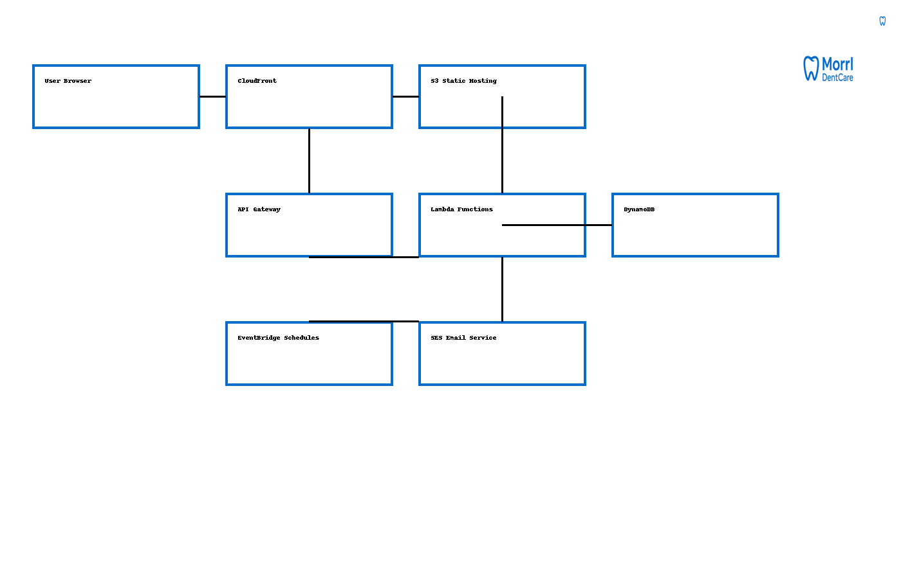

# Morrl DentCare — Family Dental Care


A production-style serverless web app for online dental appointments, built on AWS.

**Highlights**
- Serverless frontend on **S3 + CloudFront**
- API with **Amazon API Gateway** + **AWS Lambda**
- Data persistence in **DynamoDB** (table: `amzn-clinic1data`)
- **Amazon SES** transactional email: confirmation + reminders (1‑day & same‑day) from `no-reply@morrl.com`
- **Amazon EventBridge** schedules for automated reminders
- **AWS Health Dashboard** awareness for operational posture

---

## Architecture



---

## Tech Stack & AWS Services

| Area | Service(s) | Notes |
|---|---|---|
| Static hosting | Amazon S3, CloudFront | SPA + assets, HTTPS, caching |
| API | Amazon API Gateway | `POST /book`, `GET /booked` |
| Compute | AWS Lambda | Booking, validation, SES send |
| Database | Amazon DynamoDB | Table `amzn-clinic1data` (PK: `AppointmentsId`) |
| Email | Amazon SES | Verified domain `morrl.com`, sender `no-reply@morrl.com` |
| Scheduling | Amazon EventBridge | 1‑day & same‑day reminder rules |
| Monitoring | CloudWatch | Logs, metrics, alarms (as needed) |
| Operations | AWS Health Dashboard | Track regional service events |

---

## Endpoints (example)

```
GET  https://<rest-api-id>.execute-api.us-east-1.amazonaws.com/prod/booked?doctor=Dr.%20Sarah%20Johnson&date=2025-11-12
POST https://<rest-api-id>.execute-api.us-east-1.amazonaws.com/prod/book
```

**POST /book payload**
```json
{
  "name": "Jane Doe",
  "email": "jane@example.com",
  "doctor": "Dr. Sarah Johnson",
  "service": "Teeth Cleaning",
  "date": "2025-11-12",
  "time": "10:30"
}
```

---

## Deploy Summary

1. **DynamoDB**: create table `amzn-clinic1data` with PK `AppointmentsId` (String).  
2. **Lambda (BookAppointment)**: Python 3.11 runtime; IAM policy for DynamoDB + SES.  
3. **API Gateway**: `POST /book` → BookAppointment; `GET /booked` → ListBookedTimes.  
4. **SES**: verify `morrl.com`, set sender `no-reply@morrl.com`, move out of sandbox.  
5. **EventBridge**: two rules → 1‑day reminder & same‑day reminder → Reminder lambdas.  
6. **Frontend**: upload site to **S3** and front it with **CloudFront**.  

---

## Local Structure (repo)
```
.
├─ assets/
│  ├─ logo.png
│  └─ morrl_architecture.png
├─ backend/
│  ├─ lambda_book_appointment.py
│  ├─ lambda_reminder_one_day.py
│  └─ lambda_reminder_same_day.py
├─ frontend/
│  └─ appointment.html
├─ LICENSE
└─ README.md
```

> The backend lambda files correspond to the live versions you deploy in AWS.

---

## How to Run/Deploy

- **Frontend**: `aws s3 sync frontend/ s3://<your-bucket>` then attach CloudFront.  
- **Lambdas**: zip & upload, or use AWS Console. Add env vars:  
  - `TABLE_NAME=amzn-clinic1data`  
  - `SENDER_EMAIL=no-reply@morrl.com`  
  - `BASE_URL=https://morrl.com` (for links in emails)

- **Permissions**: attach a policy granting `dynamodb:Scan`, `dynamodb:PutItem`, `ses:SendEmail` and basic logs.

---

## Screenshots / Demo

_Add GIFs/screens here (booking flow, email samples)._

---

## License
MIT — see [LICENSE](LICENSE).

---

## Author
Mahmoud Abuistaiteh — Built for AWS Cloud Practitioner readiness and job‑search portfolio.
